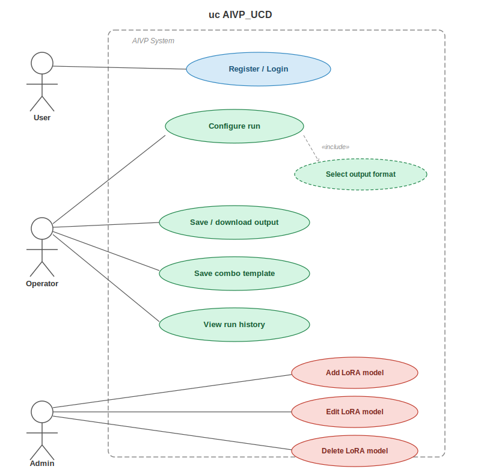
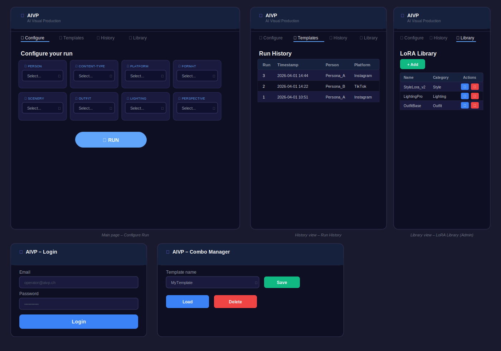
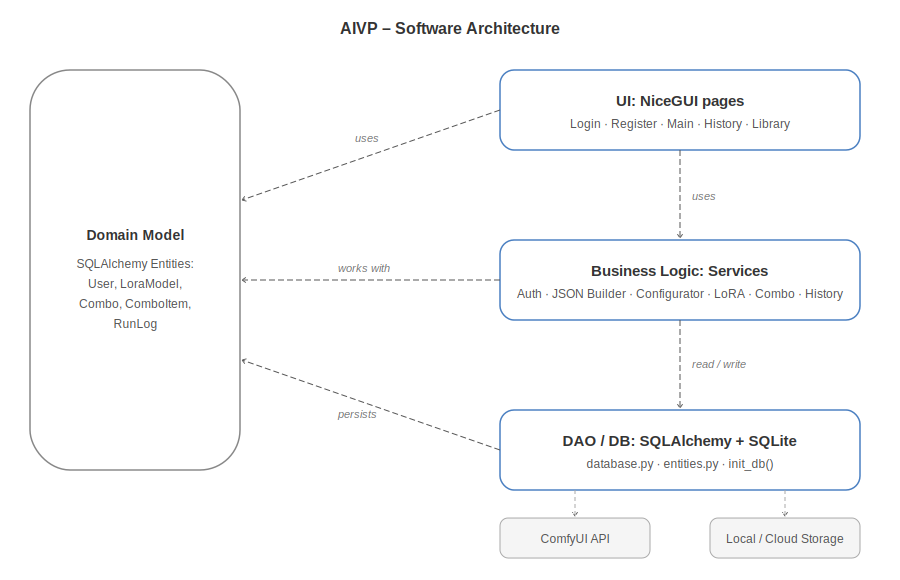
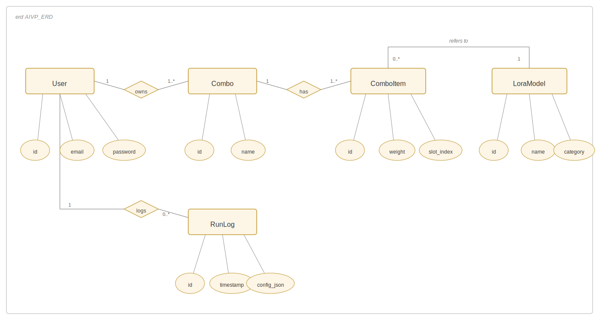

# AIVP – AI Visual Production


---

This project is intended to:

- Practice the complete process from **application requirements analysis to implementation**
- Apply advanced **Python** concepts in a browser-based application (NiceGUI)
- Demonstrate **data validation**, a clean architecture (presentation / application logic / persistence), and **database access via ORM**
- Produce clean, well-structured, and documented code (incl. tests)
- Prepare students for **teamwork and professional documentation**

---

## 📝 Application Requirements

---

### Problem

In AI content production with ComfyUI, configuring each run requires manually editing JSON files, selecting compatible LoRA models, and setting sampler parameters by hand. For a team with mixed technical backgrounds, this process takes up to 20 minutes per run and is highly error-prone — especially when switching between personas, platforms, or formats.

---

### Scenario

AIVP solves this by providing a browser-based configuration interface. The operator selects 8 parameters (Person, Content-Type, Platform, Format, Scenery, Outfit, Lighting, Perspective), each backed by a JSON config file. The **Person** dropdown is powered by the Clients database — each client has a trained LoRA model path and a prompt prefix attached to their profile. On clicking **Run**, the app merges all configs into a complete ComfyUI workflow and sends it directly to the ComfyUI API. Every run is logged with timestamp, settings, and customer info.

---

### User Stories

#### 1. Register

As a new user, I want to register with my email and password so I can access the application and have my data saved for future use.

- **Inputs:** email (`str`), password (`str`)
- **Outputs:** new user account, confirmation of successful registration

---

#### 2. Login

As a returning user, I want to log in with my email and password so I can access my previous configurations and run history.

- **Inputs:** email (`str`), password (`str`)
- **Outputs:** authenticated session, access to personal run history and combo templates

---

#### 3. Configure Run

As an user, I want to select a persona and content parameters from dropdowns so I can configure a run without editing JSON manually.

- **Inputs:** 8 parameter selections (`Person`, `Content-Type`, `Platform`, `Format`, `Scenery`, `Outfit`, `Lighting`, `Perspective`)
- **Outputs:** merged ComfyUI workflow JSON, run confirmation

---

#### 4. Trigger Run

As an user, I want to click **Run** and have the workflow sent to ComfyUI automatically.

- **Inputs:** validated workflow JSON
- **Outputs:** ComfyUI API response, `RunLog` entry with timestamp

---

#### 5. Select Output Format

As an user, I want to choose the output format of the generated image (e.g. resolution, aspect ratio) so the result fits the target platform requirements.

- **Inputs:** resolution (`str`), aspect ratio (`str`)
- **Outputs:** format parameters applied to the workflow config

---

#### 6. Save / Download Output

As an user, I want to download the generated output directly to my device or save it to cloud storage so I can use it in my workflow.

- **Inputs:** generated output file, delivery choice (`local` | `cloud`)
- **Outputs:** downloaded file or cloud storage confirmation

---

#### 7. Save Combo Template

As an user, I want to save a parameter combination as a Combo Template so I can reuse it for repeat customers.

- **Inputs:** combo name (`str`), current 8-parameter selection
- **Outputs:** saved `Combo` record in DB

---

#### 8. View Run History

As an user, I want to see a history of all past runs with their settings and timestamps so I can track and reproduce previous productions.

- **Inputs:** none (optional: filter by date or customer)
- **Outputs:** list of `RunLog` entries (`list[RunLog]`)

---

#### 9. Add LoRA Model

As an admin, I want to add a new LoRA model to the library so operators have access to the latest models.

- **Inputs:** name (`str`), category (`str`), file path (`str`)
- **Outputs:** new `LoraModel` record persisted in DB

---

#### 10. Edit LoRA Model

As an admin, I want to edit an existing LoRA model entry so I can correct or update its metadata.

- **Inputs:** model ID (`int`), updated fields (`name`, `category`, `file_path`)
- **Outputs:** updated `LoraModel` record in DB

---

#### 11. Delete LoRA Model

As an admin, I want to delete a LoRA model from the library so outdated or unused models no longer appear in the selection.

- **Inputs:** model ID (`int`)
- **Outputs:** model removed from DB; no longer appears in operator dropdowns

---

#### 12. Manage Clients

As an admin, I want to add, edit, and delete client profiles so each person's trained LoRA model and prompt prefix are stored in one place and automatically applied when they are selected as the Person in a run.

- **Inputs:** name (`str`), email (`str`), LoRA checkpoint path (`str`), prompt prefix (`str`), notes (`str`), profile picture (image upload)
- **Outputs:** `Client` record persisted in DB; client name appears in the Person dropdown on the Configure tab

---

### Use Cases



**Use Cases**
- Register / Login (User) — create an account with email and password, or log in for returning access
- Configure Run (User) — select 8 parameters and trigger workflow
- Select Output Format (Operator) — choose resolution and aspect ratio before triggering a run
- Save / Download Output (User) — download generated image to device or save to cloud storage
- Save Combo Template (User) — store a named parameter set
- Load Combo Template (User) — apply a saved set to the form
- View Run History (User) — browse past runs with settings and timestamps
- Add LoRA Model (Admin) — add a new model entry to the library
- Edit LoRA Model (Admin) — update metadata of an existing model entry
- Delete LoRA Model (Admin) — remove an outdated or unused model from the library
- Manage Clients (Admin) — add/edit/delete client profiles with LoRA model path, prompt prefix, and profile picture

**Actors**
- User (registers, logs in, configures, triggers runs and manages output)
- Admin (manages LoRA model library and client profiles)

---

### Wireframes / Mockups



---

## 🏛️ Architecture

---

### Software Architecture



**Layers / Components:**
- **UI** (NiceGUI pages and components — browser as thin client)
- **Services** (business logic: auth, JSON builder, file transfer, combo/lora/history/output/client services)
- **Persistence** (SQLite + SQLAlchemy ORM entities)

**Design Decisions:**
- Three-layer separation: Presentation → Services → Persistence
- UI never accesses the DB directly — always via service layer
- Authentication is handled server-side via `auth_service.py`; passwords are never stored in plaintext
- Business rules (JSON merge, validation) are testable without starting the UI
- ComfyUI API call is isolated in `file_transfer.py` (Adapter pattern)
- Output delivery (local download or cloud save) is handled in `output_service.py`, keeping it separate from the run pipeline
- Client profiles are stored in the DB and automatically injected into the workflow when a client is selected as the Person parameter; the `configurator.py` looks up the client by name and passes their data to `json_builder.build()`

**Design Patterns:**
- MVC (Model–View–Controller)
- Repository/Service for database access (`*_service.py`)
- Adapter for external ComfyUI API (`file_transfer.py`)

```
┌────────────────────────────────────────────────────────┐
│  UI Layer (NiceGUI)                                    │
│  Login · Register · 8 Dropdowns · Run Button           │
│  History Table · Output Download · LoRA Library        │
│  Client Profiles (Clients tab)                         │
├────────────────────────────────────────────────────────┤
│  Service Layer (Python OOP)                            │
│  Auth · JSON Builder · Validation · API Transfer       │
│  Output Delivery · Combo · LoRA · History · Client     │
├────────────────────────────────────────────────────────┤
│  Data Layer (SQLAlchemy → SQLite)                      │
│  User · LoraModel · Combo · ComboItem · RunLog         │
│  Client                                                │
└────────────────────────────────────────────────────────┘
        ↓ validated JSON
  [ ComfyUI API — external ]
        ↓ generated output
  [ Local Download  /  Cloud Storage — external ]
```

---

### 🗄️ Database and ORM



**Entities:**

- `User` — registered user with email and hashed password; anchors all run history and combo templates to an account
- `LoraModel` — represents a single LoRA model with name, category, and file path
- `Combo` — a named template grouping multiple LoRA selections; owned by a `User`
- `ComboItem` — one slot within a Combo (references a LoraModel + slot index + weight)
- `RunLog` — immutable log entry for each production run (user, config JSON, output format, timestamp)
- `Client` — a person/persona with a trained LoRA checkpoint, prompt prefix, optional profile picture, and contact info; client names power the Person dropdown on the Configure tab

`User` ↔ `RunLog` is one-to-many (each run belongs to a user). `User` ↔ `Combo` is one-to-many. `Combo` ↔ `ComboItem` is one-to-many with cascade delete. `ComboItem` ↔ `LoraModel` is many-to-one. `Client` is standalone (no FK relationships).

---

## ✅ Project Requirements

---

### 1. Browser-based App (NiceGUI)

The application runs entirely in the browser via NiceGUI. Users can:

- Register a new account with email and password
- Log in to access their personal run history and Combo Templates
- Select 8 production parameters via dropdowns (Person dropdown populated from Clients DB)
- Choose output format (resolution and aspect ratio) before triggering a run
- Trigger a ComfyUI workflow with one click — client LoRA and prompt prefix are automatically injected
- Download the generated output to their device or save it to cloud storage
- Save and load Combo Templates
- Browse personal run history with timestamps and settings
- Manage the LoRA model library (add, edit, delete — admin only)
- Manage client profiles (add, edit, delete — Clients tab)

**Architecture note:** the browser is a thin client; all UI state, authentication, and business logic run server-side in the NiceGUI app.

The UI is organized into **5 tabs**:
1. **Configure** — 8-parameter dropdowns + Run button
2. **Templates** — save and load Combo Templates
3. **History** — browse all past runs
4. **Library** — manage LoRA model library
5. **Clients** — manage client profiles with LoRA checkpoints and prompt prefixes

---

### 2. Data Validation

All inputs are validated before a run is triggered:
- Email must be a valid format on registration; password must meet minimum strength requirements
- All 8 parameter dropdowns must have a selection
- Output format (resolution, aspect ratio) must be selected before triggering a run
- Combo names must be unique and non-empty
- LoRA model entries are validated via Pydantic schemas before DB insert
- Client names must be non-empty and unique
- Passwords are never stored in plaintext — hashed via `bcrypt` before persisting to DB

---

### 3. Database Management

All data is managed via SQLAlchemy ORM (SQLite). Entities: `User`, `LoraModel`, `Combo`, `ComboItem`, `RunLog`, `Client`. Database is initialized automatically on startup via `init_db()`. Each user's run history and combo templates are scoped to their account via foreign key relationships.

---

## ⚙️ Implementation

---

### Technology

- Python 3.10+
- NiceGUI (browser-based UI)
- SQLAlchemy (ORM)
- Pydantic (validation)
- bcrypt (password hashing)
- pytest (testing)
- python-dotenv (configuration)

---

### 📂 Repository Structure

```text
Ai-Module-Configurator/
├── README.md
├── requirements.txt
├── .env.example               # DATABASE_URL + COMFYUI_OUTPUT_PATH + CLOUD_STORAGE_URL
├── .gitignore
├── main.py                    # Entry point (mounts /client_pics static files)
│
├── docs/
│   ├── ui-images/             # Screenshots and wireframes
│   └── architecture-diagrams/ # UML and ER diagrams
│
├── ui/                        # NiceGUI pages
│   ├── login_page.py          # Login form
│   ├── register_page.py       # Registration form
│   ├── main_page.py           # 5-tab shell (Configure, Templates, History, Library, Clients)
│   ├── lora_selector.py       # Configure tab — Person dropdown loads from Clients DB
│   ├── combo_manager.py
│   ├── history_view.py
│   ├── library_view.py
│   ├── client_view.py         # Clients tab — full CRUD for client profiles
│   └── components/
│
├── services/                  # Business logic
│   ├── auth_service.py        # Register, login, password hashing
│   ├── config_loader.py       # Loads JSON parameter config files
│   ├── configurator.py        # Orchestrates run: fetch client → build → send → log
│   ├── json_builder.py        # Merges 8 param configs; accepts optional client dict
│   ├── file_transfer.py
│   ├── output_service.py      # Local download + cloud save
│   ├── combo_service.py
│   ├── lora_service.py
│   ├── history_service.py
│   └── client_service.py      # CRUD for Client entity
│
├── models/                    # ORM entities & DB setup
│   ├── base.py
│   ├── database.py
│   └── entities.py            # User, LoraModel, Combo, ComboItem, RunLog, Client
│
├── utils/                     # Validators and helpers
│   ├── validators.py          # Email + password + run param validators
│   ├── password_utils.py      # bcrypt hashing helpers
│   └── helpers.py
│
├── data/                      # SQLite database + client profile pictures (gitignored)
│   └── client_pics/           # Uploaded profile pictures served at /client_pics/
└── tests/                     # pytest
```

---

### How to Run

#### 1. Project Setup

```bash
python3 -m venv venv
source venv/bin/activate      # macOS / Linux
# venv\Scripts\activate       # Windows

pip install -r requirements.txt
```

#### 2. Configuration

```bash
cp .env.example .env
```

Edit `.env` and set `COMFYUI_OUTPUT_PATH` to your local ComfyUI input directory.

#### 3. Launch

```bash
python main.py
```

Open the URL shown in the console (default: http://localhost:8080).

#### 4. Usage

Configure a run:
1. Open the app — register with your email and password, or log in if you already have an account.
2. Go to the **Clients** tab and add client profiles. Each client needs a name; optionally add a LoRA checkpoint path and a prompt prefix that will be automatically injected into every run for that person.
3. Switch to the **Configure** tab. The Person dropdown is now populated from the Clients database.
4. Select values for Person, Content-Type, Platform, Format, Scenery, Outfit, Lighting, Perspective.
5. Choose the output format (resolution and aspect ratio) for the target platform.
6. *(Optional)* Save the selection as a Combo Template for reuse.
7. Click **Run** → config is validated, client data is fetched and merged, workflow is logged and sent to ComfyUI.
8. Download the generated output to your device or save it to cloud storage.

<!--  -->

---

## 🧪 Testing

We test the three core layers of the application: business logic (unit), database persistence (DB), and the end-to-end run pipeline (integration). Each test follows the AAA pattern (Arrange → Act → Assert) and covers both happy paths and edge cases as taught in the course.

**Test mix:**
- Overall 15 tests
- 7 Unit tests: e.g. JSON merge with all 8 parameters, missing config file raises `FileNotFoundError`, valid parameter set passes validation, incomplete parameter set raises `ValidationError`, user registration with valid email and password, user login with valid credentials, edit LoRA model updates DB entry
- 4 DB tests: e.g. run history returns correct logged entries (US8), LoRA query returns seeded models, saving a Combo persists Combo + ComboItems, empty DB returns empty run history
- 3 Integration tests: e.g. full run with valid params creates RunLog entry, run with missing param is blocked before API call, saving and reloading a Combo Template restores full parameter set

> **Note:** US5 (output format selection) and US6 (download / cloud save) are outside the current test scope cap of 15 and are planned for a future test cycle.

**Template for writing test cases:**

1. Test case ID – unique identifier (e.g., TC_001)
2. Test case title/description – What is the test about?
3. Preconditions: Requirements before executing the test
4. Test steps: Actions to perform
5. Test data/input
6. Expected result
7. Actual result
8. Status – pass or fail
9. Comments – Additional notes or defect found

---

## TC_001 — JSON Builder Happy Path
| Field | Details |
|-------|---------|
| **Test case ID** | TC_001 |
| **Test case title/description** | JSON builder merges all 8 parameter configs into one valid workflow |
| **Preconditions** | 8 mock JSON config files exist (one per parameter) |
| **Test steps** | 1. **Arrange** — prepare 8 minimal JSON stubs, one per parameter. <br/> 2. **Act** — call `json_builder.build(params)` with all 8 parameters. <br/> 3. **Assert** — verify the returned dict contains all keys from all 8 stubs |
| **Test data** | One minimal JSON stub per parameter (Person, Content-Type, Platform, Format, Scenery, Outfit, Lighting, Perspective) |
| **Expected result** | Returns a single merged dict containing all keys from all 8 configs |
| **Actual result** | — |
| **Status** | — |
| **Comments** | Happy path — core merge logic; no DB or API required |

---

## TC_002 — JSON Builder Missing Config File
| Field | Details |
|-------|---------|
| **Test case ID** | TC_002 |
| **Test case title/description** | JSON builder raises `FileNotFoundError` when a parameter config file is missing |
| **Preconditions** | 7 of 8 config files exist; one is intentionally absent |
| **Test steps** | 1. **Arrange** — provide 7 valid stubs, omit one file. <br/> 2. **Act** — call `json_builder.build(params)` inside `pytest.raises(FileNotFoundError)`. <br/> 3. **Assert** — exception is raised and no partial result is returned |
| **Test data** | 7 valid stubs, 1 missing file path |
| **Expected result** | Raises `FileNotFoundError` — builder fails loudly, not silently |
| **Actual result** | — |
| **Status** | — |
| **Comments** | Exception edge case — uses `pytest.raises()` to assert the correct exception type |

---

## TC_003 — Run History Returns Correct Entries (US8)
| Field | Details |
|-------|---------|
| **Test case ID** | TC_003 |
| **Test case title/description** | Run history returns all logged runs with correct data |
| **Preconditions** | Test SQLite DB initialized; multiple `RunLog` rows (e.g. 2) seeded with known config JSON and timestamps |
| **Test steps** | 1. **Arrange** — seed multiple `RunLog` rows (e.g. 2) with distinct config JSON and timestamps. <br/> 2. **Act** — call `history_service.get_all()`. <br/> 3. **Assert** — result is a list containing all seeded `RunLog` entries with correct config JSON, customer info, and non-null timestamps |
| **Test data** | Multiple run log entries (e.g. 2) with distinct timestamps and config JSON matching the valid parameter set from TC_004 |
| **Expected result** | Returns a list containing all seeded `RunLog` entries with correct field values in descending timestamp order |
| **Actual result** | — |
| **Status** | — |
| **Comments** | Happy path for US8 — verifies the operator can view all past runs with their settings; complements the empty history edge case in TC_011 |

---

## TC_004 — Parameter Validator Happy Path
| Field | Details |
|-------|---------|
| **Test case ID** | TC_004 |
| **Test case title/description** | Validator accepts a fully populated valid parameter set |
| **Preconditions** | Pydantic schema for run parameters is defined |
| **Test steps** | 1. **Arrange** — prepare a dict with all 8 required fields set to valid string values. <br/> 2. **Act** — instantiate the Pydantic schema with that dict. <br/> 3. **Assert** — no `ValidationError` is raised and all field values match input |
| **Test data** | `{ person: "Persona_A", content_type: "Photo", platform: "Instagram", format: "Square", scenery: "Studio", outfit: "Casual", lighting: "Soft", perspective: "Front" }` |
| **Expected result** | Schema instantiates without raising a `ValidationError` |
| **Actual result** | — |
| **Status** | — |
| **Comments** | Happy path — baseline validation test |

---

## TC_005 — Parameter Validator Missing Field
| Field | Details |
|-------|---------|
| **Test case ID** | TC_005 |
| **Test case title/description** | Validator raises `ValidationError` when one required field is missing |
| **Preconditions** | Pydantic schema for run parameters is defined |
| **Test steps** | 1. **Arrange** — prepare the dict from TC_004 with the `perspective` key removed. <br/> 2. **Act** — instantiate the schema inside `pytest.raises(ValidationError)`. <br/> 3. **Assert** — error message references the `perspective` field |
| **Test data** | Same as TC_004 but `perspective` key removed |
| **Expected result** | Raises `ValidationError` identifying the missing field by name |
| **Actual result** | — |
| **Status** | — |
| **Comments** | Exception case — ensures all 8 dropdowns are enforced before a run is triggered; uses `pytest.raises()` |

---

## TC_006 — User Registration Happy Path (US1)
| Field | Details |
|-------|---------|
| **Test case ID** | TC_006 |
| **Test case title/description** | A new user can register successfully with a valid email and password |
| **Preconditions** | DB initialized; no existing user with the test email address |
| **Test steps** | 1. **Arrange** — prepare a valid registration payload with email and password. <br/> 2. **Act** — call `auth_service.register(email, password)`. <br/> 3. **Assert** — a new user record exists in the DB with the correct email and a hashed password |
| **Test data** | `{ email: "operator@aivp.ch", password: "SecurePass123!" }` |
| **Expected result** | User record is created in DB; password is stored as a hash, not plaintext |
| **Actual result** | — |
| **Status** | — |
| **Comments** | Happy path for US1 — baseline registration flow; verifies password is never stored in plaintext |

---

## TC_007 — LoRA Model Delete Removes Entry from DB (US11)
| Field | Details |
|-------|---------|
| **Test case ID** | TC_007 |
| **Test case title/description** | Deleting a LoRA model via the admin service removes it from the DB |
| **Preconditions** | Test SQLite DB initialized; 1 `LoraModel` row seeded with a known ID |
| **Test steps** | 1. **Arrange** — seed a `LoraModel` row and record its ID. <br/> 2. **Act** — call `lora_service.delete(lora_id)`, then call `lora_service.get_all()`. <br/> 3. **Assert** — the deleted model is no longer present in the returned list |
| **Test data** | 1 seeded `LoraModel` with `name: "TestLora"`, `category: "Style"`, `file_path: "/models/lora/test.safetensors"` |
| **Expected result** | `lora_service.get_all()` returns an empty list; no exception is raised |
| **Actual result** | — |
| **Status** | — |
| **Comments** | Covers the delete operation of US11 (admin deletes LoRA model); complements TC_009 (read) and TC_015 (edit) |

---

## TC_008 — User Login Happy Path (US2)
| Field | Details |
|-------|---------|
| **Test case ID** | TC_008 |
| **Test case title/description** | A registered user can log in successfully with correct credentials |
| **Preconditions** | DB initialized; a user with `email: "operator@aivp.ch"` is already registered |
| **Test steps** | 1. **Arrange** — seed a registered user in the DB. <br/> 2. **Act** — call `auth_service.login(email, password)`. <br/> 3. **Assert** — a valid session token or success response is returned |
| **Test data** | `{ email: "operator@aivp.ch", password: "SecurePass123!" }` |
| **Expected result** | Login succeeds and returns a valid session token; no exception is raised |
| **Actual result** | — |
| **Status** | — |
| **Comments** | Happy path for US2 — verifies returning users can authenticate; complements TC_006 registration flow |

---

## TC_009 — LoRA Library DB Query
| Field | Details |
|-------|---------|
| **Test case ID** | TC_009 |
| **Test case title/description** | LoRA query returns all seeded models |
| **Preconditions** | Test SQLite DB initialized with `init_db()`; 3 `LoraModel` rows seeded |
| **Test steps** | 1. **Arrange** — seed 3 `LoraModel` rows with distinct names and categories. <br/> 2. **Act** — call `lora_service.get_all()`. <br/> 3. **Assert** — result is a list of exactly 3 `LoraModel` objects with correct field values |
| **Test data** | 3 seeded models with distinct names and categories |
| **Expected result** | Returns a list of exactly 3 `LoraModel` objects with correct field values |
| **Actual result** | — |
| **Status** | — |
| **Comments** | Verifies ORM mapping and seed data integrity |

---

## TC_010 — Combo Persistence with ComboItems
| Field | Details |
|-------|---------|
| **Test case ID** | TC_010 |
| **Test case title/description** | Saving a Combo with ComboItems persists the full relationship |
| **Preconditions** | Test SQLite DB initialized; at least 2 `LoraModel` rows exist |
| **Test steps** | 1. **Arrange** — create a `Combo` object with 2 `ComboItems` referencing existing models. <br/> 2. **Act** — call `combo_service.save(combo)`, then re-query the combo by name. <br/> 3. **Assert** — queried combo has 2 items with correct `lora_model_id` and `weight` values |
| **Test data** | Combo name: `"TestCombo"`, 2 items with weights `0.8` and `0.6` |
| **Expected result** | Queried combo has 2 items with correct `lora_model_id` and `weight` values |
| **Actual result** | — |
| **Status** | — |
| **Comments** | Tests one-to-many cascade and foreign key integrity |

---

## TC_011 — Empty Run History (Edge Case)
| Field | Details |
|-------|---------|
| **Test case ID** | TC_011 |
| **Test case title/description** | RunLog query on empty DB returns empty list (edge case) |
| **Preconditions** | Test SQLite DB initialized with no `RunLog` rows |
| **Test steps** | 1. **Arrange** — initialize a clean test DB with no run history. <br/> 2. **Act** — call `history_service.get_all()`. <br/> 3. **Assert** — result is `[]` and no exception is raised |
| **Test data** | Empty DB |
| **Expected result** | Returns `[]` without raising an exception |
| **Actual result** | — |
| **Status** | — |
| **Comments** | Edge case — ensures the history view does not crash on first launch before any runs |

---

## TC_012 — Full Run Pipeline Happy Path
| Field | Details |
|-------|---------|
| **Test case ID** | TC_012 |
| **Test case title/description** | Full run with valid params creates a RunLog entry |
| **Preconditions** | DB initialized; ComfyUI API call mocked with `unittest.mock.patch` to return HTTP 200 |
| **Test steps** | 1. **Arrange** — prepare a valid 8-parameter set and mock the ComfyUI API. <br/> 2. **Act** — call `configurator.run(params)`. <br/> 3. **Assert** — exactly 1 `RunLog` row exists with correct config JSON and a non-null timestamp |
| **Test data** | Same valid set as TC_004 |
| **Expected result** | Exactly 1 `RunLog` row exists with correct config JSON and non-null timestamp |
| **Actual result** | — |
| **Status** | — |
| **Comments** | Happy path — covers the full pipeline: validate → fetch client → build JSON → send → log |

---

## TC_013 — Invalid Run Blocked Before API Call
| Field | Details |
|-------|---------|
| **Test case ID** | TC_013 |
| **Test case title/description** | Run with a missing parameter is blocked before the API call is made |
| **Preconditions** | DB initialized; ComfyUI API mocked to detect whether it was called |
| **Test steps** | 1. **Arrange** — prepare a parameter set with `perspective` missing and set up the API mock. <br/> 2. **Act** — call `configurator.run(params)` inside `pytest.raises(ValidationError)`. <br/> 3. **Assert** — `ValidationError` is raised, API mock call count is `0`, and no `RunLog` row was created |
| **Test data** | Same as TC_005 (missing `perspective`) |
| **Expected result** | `ValidationError` raised; API mock never called; no `RunLog` row created |
| **Actual result** | — |
| **Status** | — |
| **Comments** | Exception integration case — ensures invalid input is blocked end-to-end before touching external systems; uses `pytest.raises()` |

---

## TC_014 — Combo Template Save and Reload Cycle
| Field | Details |
|-------|---------|
| **Test case ID** | TC_014 |
| **Test case title/description** | Saving and reloading a Combo Template restores the full parameter set |
| **Preconditions** | DB initialized; at least 2 `LoraModel` rows seeded |
| **Test steps** | 1. **Arrange** — prepare a `Combo` with 2 items at known weights and slot indices. <br/> 2. **Act** — call `combo_service.save(combo)`, then reload via `combo_service.get_by_name("TestCombo")`. <br/> 3. **Assert** — reloaded combo has identical name, item count, weights, and slot indices |
| **Test data** | Combo with 2 items, weights `0.8` and `0.6`, slot indices `0` and `1` |
| **Expected result** | Reloaded combo has identical name, item count, weights and slot indices as saved |
| **Actual result** | — |
| **Status** | — |
| **Comments** | Validates the full save → persist → reload cycle used by operators for repeat runs |

---

## TC_015 — Edit LoRA Model Updates DB Entry (US10)
| Field | Details |
|-------|---------|
| **Test case ID** | TC_015 |
| **Test case title/description** | Editing an existing LoRA model updates its metadata correctly in the DB |
| **Preconditions** | Test SQLite DB initialized; 1 `LoraModel` row seeded with known values |
| **Test steps** | 1. **Arrange** — seed a `LoraModel` with `name: "OldName"` and `category: "Style"`. <br/> 2. **Act** — call `lora_service.update(lora_id, { name: "NewName", category: "Lighting" })`, then re-query the record. <br/> 3. **Assert** — the updated record reflects the new name and category; no duplicate or extra rows are created |
| **Test data** | Original: `{ name: "OldName", category: "Style" }` → Updated: `{ name: "NewName", category: "Lighting" }` |
| **Expected result** | DB record is updated in place; `lora_service.get_all()` returns 1 row with the new values |
| **Actual result** | — |
| **Status** | — |
| **Comments** | Covers the edit operation of US10 — admin can correct or update LoRA model metadata; complements TC_007 (delete) and TC_009 (read) |

---

**Run:**
```bash
pytest
```

Run tests by category:
```bash
pytest -m unit
pytest -m db
pytest -m integration
```

Generate a coverage report:
```bash
pytest --cov=services --cov=models --cov=utils --cov-report=html
```

---

### Libraries Used

- nicegui
- sqlalchemy
- pydantic
- bcrypt
- python-dotenv
- pytest

---

## 👥 Team & Contributions

| Name | Contribution |
|------|--------------|
| Cédric Neuhaus | NiceGUI UI, component design, client-state management |
| Samson Hadgu | JSON builder, ComfyUI API integration, file transfer |
| Fabian Eppenberger | SQLAlchemy ORM, database schema, pytest tests |

---

## 📝 License

Academic project — FHNW, Advanced Programming, BSc BIT, Spring Semester 2026.
